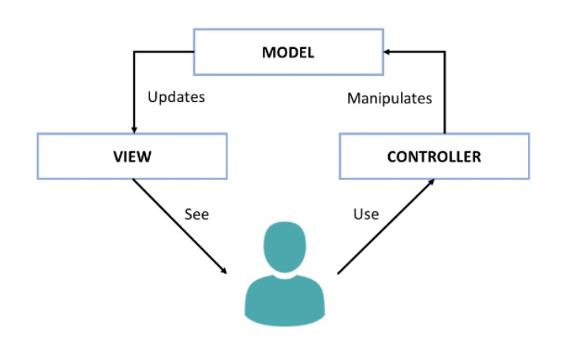
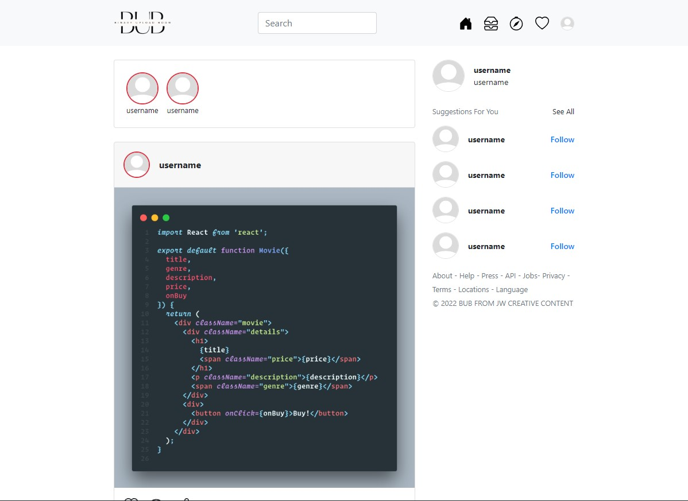
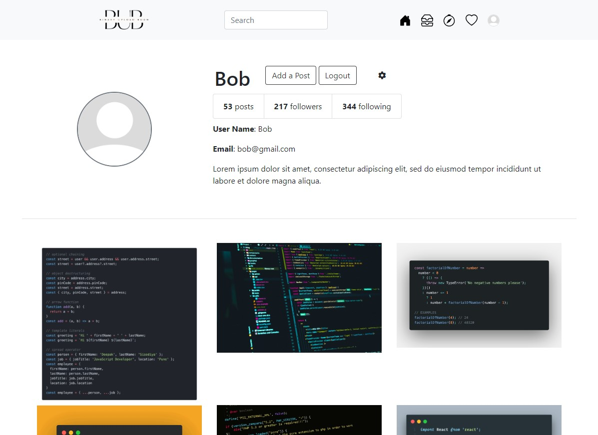
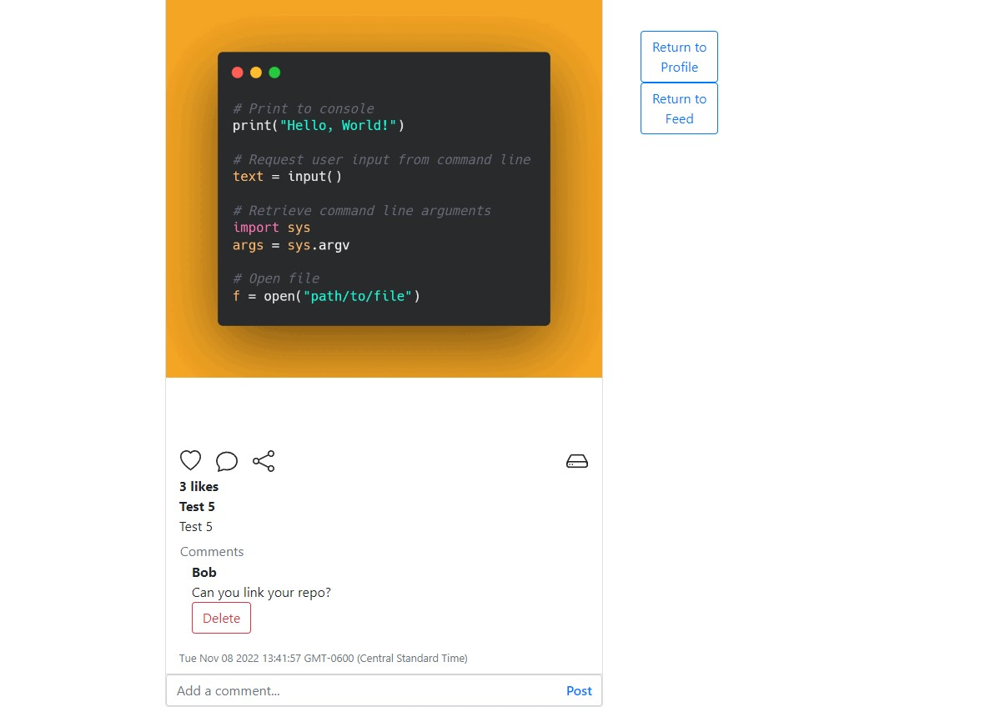

# BUB (Code Review Social Platform)

Binary Upload Boom (BUB) is a social media platform for developers to post updates on current work and get feedback on code optimizations. Users can create an account on the platform, post media that can be liked/commented on, and browse a feed of posts from other users within the network.

This project exemplifies the Model-View-Controller (MVC) organization framework. 

* Model - Defines the data structures, is manipulated by the controller, and updates the views based on changes made by user input.
* View - Displays the user interface and allows for interactivity within an application.
* Controller - Houses the code logic contained within the API, manages requests from the view and executes changes to the model as needed. 

Learn more here: https://developer.mozilla.org/en-US/docs/Glossary/MVC#:~:text=MVC%20

Figure 1 - Interaction within MVC Pattern

Mohd Nor, Rizal & Jalaldeen, M & Razi, M.J.M. & Zakaria, Adlan & Safiuddin, Ahmad & Fakhri, Ahmad & Zulaiha, Puteri & Saat, Abdul. (2018). Cloudemy: Step into the Cloud. 

## Tech Used
Main stack: Node, Express, MongoDB (Mongoose), JavaScript, EJS, Bootstrap

Noteworthy Dependencies:
* Cloudinary 
  * Cloud storage and media transformation tools API
  * https://cloudinary.com/documentation/node_integration 
* Passport
  * Authentication middleware for Node.js
  * https://www.passportjs.org/
* bcrypt
  * Password salting for database security/protection
  * https://www.npmjs.com/package/bcryptjs
* Morgan
  * HTTPS request logging for Node.js to aid development process
  * https://www.npmjs.com/package/morgan

## Future Work
* Integrate ability to update profile information with bio/change of email.
* Allow for search of users and enable followers feature.
* Filter options for feed.

## Sample UI

Figure 2 - Preview of Feed Page

Figure 3 - Preview of Profile Page

Figure 4 - Preview of Individual Post Page
